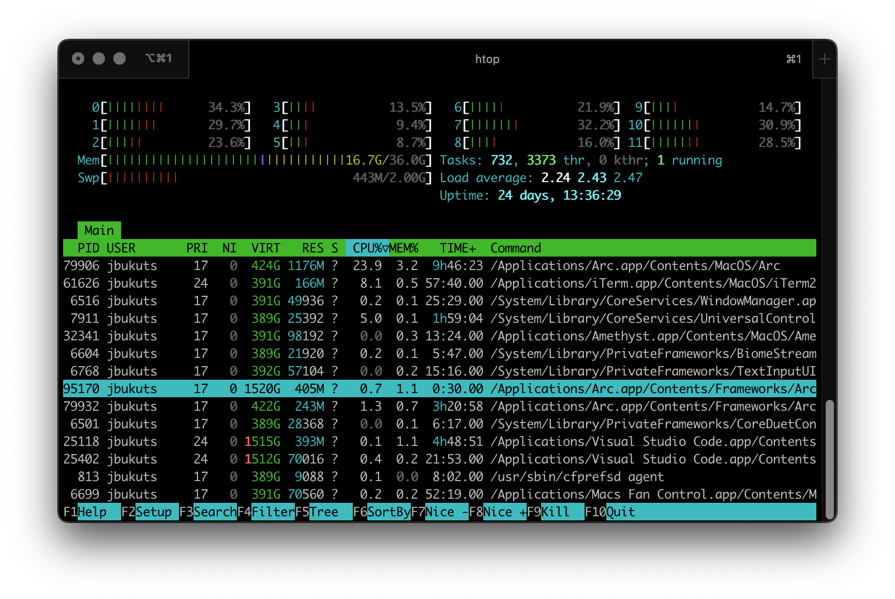

# Image

Image syntax can be used in GitHub-flavored Markdown like so:

```md

```

This code results in an image displaying like so:


## Implementation

Images can be stored within the `content` directory like any other form of content. However, because of how Next.js handles static assets when they are referenced as relative paths within an `Image` component they are assumed to be within the `public` directory.

To _"cheat"_ this limitation, when running a development instance of the server a symlink is created within the `public` directory to point to the top-level content folder. This bridges the gap and allows relative paths to be used in the Markdown content.

Then when building out static assets this symlink is removed to decrease the size of the total assets. This is fine given the custom remark plugin `remark-img` that's used when compiling MDX will convert any relative image links to point to their absolute URL counterparts within the GitHub repository.

Both the creation and deletion of the symlinks are instrumented as some simple Node scripts (`create_symlink.mjs` and `remove_symlink.mjs`) contained within the top-level `bin` folder. They are run as the first steps of `npm run dev` and `npm run build` respectively.
